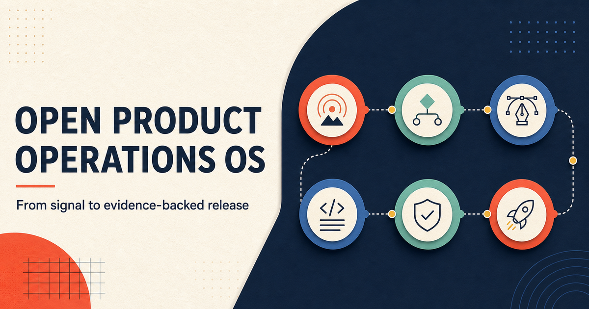
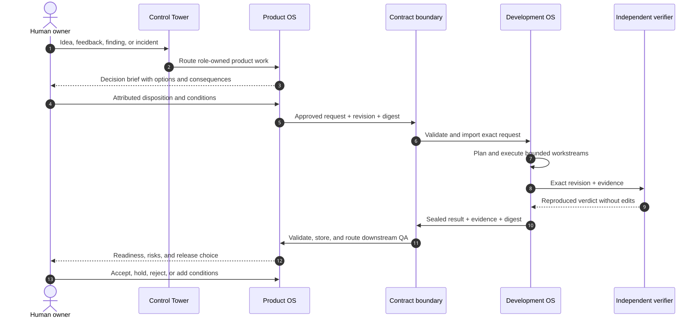

<div align="center">
  

  <br>

  <a href="https://github.com/sedwna/open-product-operations-os/actions/workflows/ci.yml"></a>
  
  
  
  

  <h3>You describe the product. A governed organisation takes it to evidence-backed delivery.</h3>

  <p>
    One human-facing control tower. Two independently governed operating systems.<br>
    Human authority governs <em>what and why</em>; engineering proves <em>how and what changed</em>.
  </p>

  <p>
    <a href="#the-system-in-90-seconds"><strong>Understand it in 90 seconds</strong></a>
    ·
    <a href="#product-operations-os"><strong>Product OS</strong></a>
    ·
    <a href="#development-operations-os"><strong>Development OS</strong></a>
    ·
    <a href="#start-here"><strong>Start here</strong></a>
  </p>
</div>

---

## The system in 90 seconds

Open Product Operations OS gives a coding agent the operating contracts of a product organisation,
not merely a prompt to write code. A signal becomes researched intent, an approved delivery
contract, independently verified engineering work, product evidence, and finally a human-controlled
release decision.

<div align="center">
  
  <br>
  <sub><a href=".github/diagrams/system-overview.mmd">Mermaid source</a></sub>
</div>

The loop is deliberately split:

| System | Owns | Must never pretend to own |
| --- | --- | --- |
| **Product Operations OS** | Problem, users, priority, scope, acceptance criteria, product evidence, readiness | Code completion, deployment state, or technical verification |
| **Development Operations OS** | Architecture, code, data, infrastructure, tests, technical evidence, implementation revision | Product direction, priority, risk acceptance, or final product acceptance |
| **Human product owner** | Direction, material trade-offs, risk acceptance, crossing into engineering, and release authority | Folder layouts, schemas, task routing, evidence bookkeeping, or agent mechanics |
| **Control Tower** | Current-state projection, dependency routing, bounded coordination, and asking for decisions | Making a human decision or certifying a material claim |

> [!IMPORTANT]
> Chat is an interface, not the source of truth. Git-tracked contracts, attributed decisions,
> content digests, evidence, and read-back receipts are what let a different agent resume the work.

## What this is — and is not

This repository is an **operating system for product delivery**: templates, schemas, role
boundaries, a dry-run-first runtime, an MCP control surface, and an independent engineering
operating model. New products are created as one GitHub repository with `product/` and
`development/` roots; existing split repositories remain supported.

It is not:

- an autonomous daemon that silently changes production;
- a replacement for human product authority;
- a single giant agent allowed to research, build, test, approve, and verify its own work;
- a dashboard whose status is more authoritative than the repositories beneath it;
- a promise that activity equals a correct or releasable product.

### Enough process, enough engineering

The OS is explicitly protected against two agent failure modes: **overqualification** (asking for
information that cannot change the next safe action) and **overengineering** (adding complexity not
justified by a present requirement or risk). Agents inspect canonical state before asking, record
unknowns instead of forcing completeness, implement the smallest reversible change, and scale
assurance depth with impact. Security, evidence, independent verification, and human authority stay
mandatory. Engineering follows an ordered ladder — no build, reuse, standard/native capability,
installed dependency, then minimum local code — and records the ceiling and upgrade trigger of any
deliberate shortcut. Read the [proportional-delivery policy](docs/architecture/proportional-delivery.md).

## One event, end to end

Every idea, finding, incident, feedback item, or delivery request travels through a replayable
lifecycle. Steps only open when their dependencies and required gates are satisfied.

| Step | What happens | Durable output | Who can unblock it |
| ---: | --- | --- | --- |
| 1 | A real signal enters intake with its source | Normalized, deduplicated event | Control Tower |
| 2 | Discovery separates evidence from assumptions | Sourced findings and named unknowns | Discovery owner |
| 3 | Options and consequences become a decision brief | Attributed decision request | Human product owner |
| 4 | Approved intent is mapped to topology, journeys, and issues | Product impact and issue contracts | Product owners |
| 5 | Scope becomes testable and bounded | Delivery contract and acceptance criteria | Delivery-contract owner |
| 6 | Validation and risk controls are designed before build | Scenarios, expected evidence, risk findings | Validation and audit owners |
| 7 | The owner authorizes the product-to-engineering crossing | Human disposition plus conditions | Human product owner |
| 8 | A sealed request crosses into the application repository | Schema-valid contract, revision, digest, receipt | Development adapter |
| 9 | Engineering plans and executes only the affected workstreams | Code and discipline-owned evidence | Engineering owners |
| 10 | A separate verifier reproduces material engineering claims | Read-only technical verdict | Independent engineering verifier |
| 11 | A sealed result returns to Product Operations | Result, exact revision, evidence, digest, receipt | Development adapter |
| 12 | Product QA, controlled write, independent verification, and readiness run | Product evidence and readiness record | Product owners and verifier |
| 13 | Release, production, or corrective-loop decisions are recorded | Human acceptance or a new corrective event | Human product owner |

<div align="center">
  
  <br>
  <sub><a href=".github/diagrams/event-lifecycle.mmd">Mermaid source</a></sub>
</div>

---

## Product Operations OS

The product side owns **meaning**. It turns uncertain input into a product decision and a contract
that another organisation can implement without guessing. After engineering returns, it validates
the user-visible outcome without rewriting engineering's factual claims.

<div align="center">
  
  <br>
  <sub><a href=".github/diagrams/product-operations.mmd">Mermaid source</a></sub>
</div>

### What the product side produces

- a source-backed idea or finding, not a reconstructed chat memory;
- explicit unknowns, assumptions, and product risks;
- human-attributed decisions with rationale and optional conditions;
- product topology, user journeys, prioritized issue contracts, and dependencies;
- testable acceptance criteria and a bounded delivery contract;
- validation plans, scenarios, expected outcomes, and evidence requirements;
- factual QA results, controlled-write receipts, independent verdicts, and readiness records;
- a 23-tab canonical workbook projection for operational visibility and lineage.

<details>
<summary><strong>The 13 product boundaries</strong></summary>

<br>

| Role | Team boundary | Responsibility |
| --- | --- | --- |
| `RB-01` | Control Coordination | Routes events, dependencies, blockers, and human-facing cycle reports |
| `RB-02` | Idea & Decision | Triages ideas and prepares choices without deciding for the owner |
| `RB-03` | Discovery & Research | Produces sourced findings, uncertainty, and research gaps |
| `RB-04` | Topology & Journeys | Owns product areas, capabilities, roles, journeys, and impacts |
| `RB-05` | Issue Lifecycle | Deduplicates findings and maintains prioritized issue contracts |
| `RB-06` | Delivery Contract | Writes bounded, testable acceptance and hand-off contracts |
| `RB-07` | Validation Design | Defines scenarios, data, expected outcomes, and evidence contracts |
| `RB-08` | Risk & Logic Audit | Challenges assumptions, edge cases, safety, consistency, and controls |
| `RB-09` | QA Execution & Evidence | Executes approved scenarios and records reproducible factual results |
| `RB-10` | Workbook Integrity & Controlled Write | Applies authorized manifests and proves complete read-back |
| `RB-11` | Readiness & Release | Calculates readiness and assembles release and rollback records |
| `RB-12` | Independent Verification | Reproduces material product claims without editing producer output |
| `RB-13` | Development Adapter | Exchanges sealed contracts and factual results with Development OS |

Role IDs are durable contract identifiers. The human-facing panel uses team names.

</details>

---

## Development Operations OS

The development side is an independent operating system installed in the suite's
**`development/` root**, alongside the application code. The suite has one Git history, while
`development/` remains the source of truth for code and technical evidence. Development OS does
not copy the Product workbook across the boundary or take over Product authority. Existing
applications may still use a separately linked repository during migration.

<div align="center">
  
  <br>
  <sub><a href=".github/diagrams/development-operations.mmd">Mermaid source</a></sub>
</div>

The planner always includes coordination, architecture, security, quality engineering,
documentation, and independent verification. It adds specialist workstreams and gates from the
declared impact. Database impact, for example, activates migration, compatibility, query/index,
backup, restore, capacity, and rollback evidence.

### What the development side produces

- a deterministic, dependency-ordered engineering plan;
- role-scoped workstreams with explicit allowed and prohibited write paths;
- code, architecture decisions, migrations, infrastructure, tests, and documentation;
- mandatory and impact-specific quality-gate evidence;
- an exact implementation revision and content digest;
- a read-only independent technical verdict;
- a sealed result tied to the original product-request digest.

<details>
<summary><strong>The 15 engineering boundaries</strong></summary>

<br>

| Role | Team boundary | Responsibility |
| --- | --- | --- |
| `ENG-01` | Engineering Coordination | Sequences work, manages technical dependencies, consolidates status |
| `ENG-02` | Solution Architecture | Defines system boundaries and records technical decisions |
| `ENG-03` | Frontend & Accessibility | Owns web UI, design-system integration, RTL, accessibility, browsers |
| `ENG-04` | Backend, API & Integration | Owns services, APIs, compatibility, integration, and messaging |
| `ENG-05` | Client Applications | Owns mobile and desktop clients, offline behavior, upgrades |
| `ENG-06` | Database & Storage | Owns models, migrations, indexes, cache, search, backup, and recovery |
| `ENG-07` | Data, Analytics & AI | Owns data pipelines, analytics contracts, provenance, and model quality |
| `ENG-08` | Platform, Cloud & Network | Owns infrastructure, DNS, CDN, queues, capacity, network, and cost |
| `ENG-09` | Security, Privacy & Compliance | Threat-models identity, access, privacy, dependencies, and supply chain |
| `ENG-10` | Quality Engineering | Owns automated test strategy, integration/E2E tests, and regression risk |
| `ENG-11` | SRE, Observability & Performance | Owns telemetry, service objectives, resilience, incidents, and recovery |
| `ENG-12` | Developer Experience & Delivery | Owns builds, CI/CD, reproducible artifacts, release and rollback mechanics |
| `ENG-13` | SEO & Web Discovery | Verifies crawlability, metadata, structured data, rendering, and web vitals |
| `ENG-14` | Technical Documentation | Maintains architecture docs, runbooks, migration and support knowledge |
| `ENG-15` | Independent Engineering Verification | Reproduces technical claims and may not edit the output under review |

Actors are configurable; authority boundaries are canonical. A material producer and its verifier
must be different actors.

</details>

### Engineering quality gates

Always-required gates cover architecture, code review, automated tests, security, supply chain,
documentation, and independent verification. The plan adds database, API compatibility,
infrastructure/network, privacy/compliance, accessibility, performance, reliability, and SEO gates
when the impact requires them. A result cannot be complete until every selected gate passes with
the required evidence.

The generated `ENG-09` contract selects `quick`, `standard`, or `deep` assessment from the plan's
canonical risk class. It treats scanner output as a candidate until safe evidence demonstrates
impact, deduplicates by root cause, refuses scope expansion from discovered text, and leaves
material security claims for read-only `ENG-15` reproduction. External active testing is never
implied by a development request and needs separate attributed human authorization.

---

## The boundary between Product and Development

The two systems do not share one mutable board and do not write each other's facts. They exchange
immutable, schema-validated, content-addressed contracts.

| Product → Development request | Development → Product result |
| --- | --- |
| Approved problem, outcome, scope, and priority | Original request identity and digest |
| Acceptance criteria and non-functional requirements | Exact implementation revision and content digest |
| Impact domains and dependencies | Completed workstreams and factual technical state |
| Validation expectations and evidence contract | Selected quality gates and evidence references |
| Allowed and prohibited write boundaries | Independent engineering disposition |
| Human approval attribution and source revision | Known limitations, remaining risks, and environment state |

Both crossings emit durable receipts. Replaying the same contract is idempotent; changing content
under an existing identity is rejected rather than silently rewriting history.

<div align="center">
  
  <br>
  <sub><a href=".github/diagrams/contract-boundary.mmd">Mermaid source</a></sub>
</div>

## Human gates: where the system must stop

The owner retains authority over product direction and priority, material scope trade-offs, risk
acceptance, sensitive access, destructive operations, crossing into engineering, production
mutation, and final user-visible acceptance. The system prepares the decision; it does not infer a
disposition from silence.

Each gate preserves:

- the decision context and the exact options presented;
- a recommendation with consequences and named risks;
- the deciding human actor;
- approve/reject or the selected option;
- optional conditions;
- the owner's rationale in their own words;
- the revision and downstream tasks affected by that decision.

When the host supports an interactive decision dialog, the request is bounded to **60 seconds**.
A timeout, dismissed dialog, or unsupported UI never becomes approval. The Control Tower falls back
to the in-conversation panel/composer and records only what the owner actually submits.

## Evidence, writes, and independent verification

Completion is a chain of proofs, not a status label.

<div align="center">
  
  <br>
  <sub><a href=".github/diagrams/evidence-chain.mmd">Mermaid source</a></sub>
</div>

Six invariants hold the chain together:

| Invariant | Enforcement |
| --- | --- |
| **Nobody certifies their own material claim** | Producer and verifier identities are separated and validated |
| **Human authority remains human** | Models cannot author an owner's disposition |
| **A claim without evidence is not done** | Evidence references are required by the relevant contract and gate |
| **A write is not trusted until read back** | Controlled writers compare the complete result and emit a receipt |
| **External effects do not happen by accident** | Runtime actions plan first; provider adapters and executors are disabled by default |
| **History is corrected, not erased** | Amendments and dispositions append or supersede with lineage |

## The Control Tower you work with

The Control Tower is the human-facing projection of both systems. It answers four questions without
requiring the owner to understand role codes:

1. Where are we in the cycle?
2. Which team owns the active work?
3. What is actually blocking progress?
4. Which decision, if any, requires a human now?

```text
┌──────────────────────────────────────────────────────────────┐
│  PRODUCT → ENGINEERING → VERIFY → PRODUCT QA → RELEASE       │
│  Phase: engineering verification                ● running    │
│  ──────────────────────────────────────────────────────────  │
│  Product cards   9 done · 0 active · 0 blocked               │
│  Engineering     7 done · 1 active · 2 waiting               │
│                                                              │
│  ACTIVE                                                      │
│  Independent Engineering Verification                        │
│  Reproducing: tests · security evidence · revision digest    │
│                                                              │
│  WAITING ON YOU                                              │
│  Nothing. Production authority has not been requested.       │
│                                                              │
│  Evidence: 18 refs · Risks: 1 open · Decisions: 0 pending    │
└──────────────────────────────────────────────────────────────┘
```

The MCP server exposes **8 read-only tools by default**. Starting it with `--allow-writes` exposes
**20 tools total**, adding intake, cycle operation, product and engineering work hand-offs,
delivery crossing, adoption, amendments, and human-decision recording. Write-enabled still means
dry-run-first and authority-checked; it does not mean unrestricted mutation.

If this repository's MCP source changes while a host is still holding the old process, read tools
report `MCP_RESTART_REQUIRED` and planning/write tools fail closed until the host is restarted. This
prevents a stale control surface from writing against newer contracts.

## What exists on disk

The operating-system source and every generated product suite have distinct jobs. A new suite is
always published as one repository containing both authority roots:

```text
open-product-operations-os/       # this repository: runtime + reusable contracts
├── src/                          # CLI, runtime, MCP control surface, adapters
├── templates/                    # product governance, roles, workbook, workflows
├── schemas/                      # published validation contracts
├── docs/                         # architecture, setup, security, runtime guidance
└── examples/                     # worked operating examples

my-product/                       # one GitHub repository and one Git history
├── README.md                     # map of both organisations
├── AGENTS.md                     # root routing and write-boundary contract
├── product/                      # Product Operations authority root
│   ├── agents/roles/             # RB-01 through RB-13
│   ├── taskboard/                # Product cards
│   ├── governance/               # authority, ownership, routing
│   ├── workbook/                 # discovery, decisions, acceptance, readiness
│   └── .product-ops/             # Product runtime state and contract receipts
└── development/                  # application + Engineering authority root
    ├── <your source code>
    ├── engineering/governance/   # ENG-01 through ENG-15
    ├── engineering/taskboard/    # Engineering workstreams
    ├── engineering/              # architecture, standards, gates and evidence
    ├── .development-os/          # Engineering runtime state and receipts
    └── development-os.config.json
```

The generated `product/` root also carries a canonical **23-tab workbook model** covering
configuration, roles, ownership, events, tasks, ideas, discovery, decisions, issues, delivery,
validation, evidence, observations, quality control, readiness, releases, writer manifests,
receipts, and lineage.

---

## Start here

### Let an agent set up a new product

```bash
git clone https://github.com/sedwna/open-product-operations-os.git
cd open-product-operations-os
npm ci --omit=dev
```

Open Claude Code, Codex, or another capable agent in this repository and say:

> Set me up with a new product.

The agent follows [`AGENTS.md`](AGENTS.md): it checks Node, creates a two-root suite beside this
repository, validates both operating systems and their link, asks only product questions, records
the first real signal, routes the first cycle, connects the host to `product/`, and hands control
back with the first decision visible.

**Requirement:** Node.js 20 or newer.

<details>
<summary><strong>Drive product setup yourself</strong></summary>

<br>

```bash
node ./src/cli.js init-suite ../my-product --dry-run
node ./src/cli.js init-suite ../my-product --provider codex
node ./src/cli.js validate-suite ../my-product
```

Then configure the product, record intake, and operate one bounded cycle. Runtime commands plan by
default; `--apply` is always explicit. See the [runtime guide](docs/runtime/README.md) for the full
command contract.

</details>

### Bring an existing application into the model

New suites already contain `development/`; place or migrate application code there through an
explicit, history-preserving change. For a legacy application that must remain in its own
repository, the split-repository integration remains available:

```bash
node ./src/development-cli.js init ../my-application --dry-run
node ./src/development-cli.js init ../my-application
node ./src/development-cli.js validate ../my-application

node ./src/cli.js link ../my-product/product --application ../my-application
node ./src/cli.js link ../my-product/product --application ../my-application --apply
```

After linking, adoption surveys every application path. Each path is either assigned to a
product-owner boundary for interpretation or excluded with a named reason. Derived knowledge stays
a sourced **observation** until the human owner reviews it; a repository with unaccounted paths is
never reported as fully adopted.

### Connect the conversation host

Claude Code reads `.mcp.json` from the **suite root** and targets `./product`. Codex uses
`codex mcp add` and stores the entry globally with the absolute `<suite>/product` path. In both
cases, open the suite root so the agent can see both folders, fully restart the host after an add,
remove, or target change, then call `product_ops_status` and verify the reported project identity
before any write.

Follow [Connecting a host](docs/setup/connecting-a-host.md) for the exact Claude Code and Codex
steps. The package is not published to npm yet, so do not use an `npx --package` shortcut.

## Failure behavior is part of the design

The system fails closed at material boundaries:

| Condition | What happens |
| --- | --- |
| Product approval is missing | No engineering request is exported |
| A dependency or required evidence is unresolved | Downstream work remains blocked |
| Contract contains secrets or violates its schema | Synchronization is refused |
| A path escapes the configured engineering boundary | The plan or returned work is rejected |
| Producer and verifier are the same actor | Completion is refused |
| Request identity, digest, task, or revision does not match | Import is refused |
| A selected engineering gate has no passing evidence | No complete engineering result is emitted |
| Production authorization is missing | Technical work may complete; deployment remains blocked |
| Interactive decision UI times out or closes | No decision is recorded |
| MCP process is stale after source changes | Reads warn; plans and writes are refused until restart |

Independent verification can return `PASS`, `EVIDENCE GAP`, `CONTROL FAILURE`,
`LIVE PROPAGATION FAILURE`, or `HUMAN DECISION REQUIRED`. Non-passing dispositions create a
bounded corrective loop; they do not disappear behind a green dashboard.

## Current maturity

```text
Current stage: Foundation
Public API stability: Not guaranteed
Recommended use: Evaluation and pilot projects
```

The package pipeline checks schemas, role separation, clean-room identity, portable hashes, tests,
packed artifacts, clean clone/archive behavior, dependencies, licences, and an SBOM across supported
environments. Passing automation is producer evidence, not an independent release verdict.

## Reading map

| If you want to… | Read… |
| --- | --- |
| Get set up with a new product | [Start here](START-HERE.md) |
| Connect Claude Code or Codex | [Connecting a host](docs/setup/connecting-a-host.md) |
| Understand ownership and sources of truth | [Architecture overview](docs/architecture/overview.md) |
| Follow one governed event | [Event lifecycle](docs/architecture/event-lifecycle.md) |
| Operate intake, approvals, cycles, and reports | [Runtime and Control Tower](docs/runtime/README.md) |
| Understand the MCP authority surface | [MCP control surface](docs/architecture/mcp-control-surface.md) |
| Install and run the engineering half | [Development Operations OS](docs/development/README.md) |
| Understand contract synchronization | [Dual operating-system architecture](docs/architecture/dual-operating-system.md) |
| Work with the canonical workbook | [Workbook operating model](docs/workbook/operating-model.md) |
| Review the security model | [Security model](docs/security-model.md) |
| Connect external systems safely | [Provider adapters](docs/runtime/provider-adapters.md) |

## Contributing

Evidence-backed improvements are welcome. Start with [`CONTRIBUTING.md`](CONTRIBUTING.md), keep
changes inside an explicit role and write boundary, and never represent producer evidence as
independent certification.

<div align="center">
  <br>
  <strong>Open Product Operations OS</strong><br>
  Human authority · explicit ownership · durable contracts · reproducible evidence
  <br><br>
  Apache License 2.0
</div>
