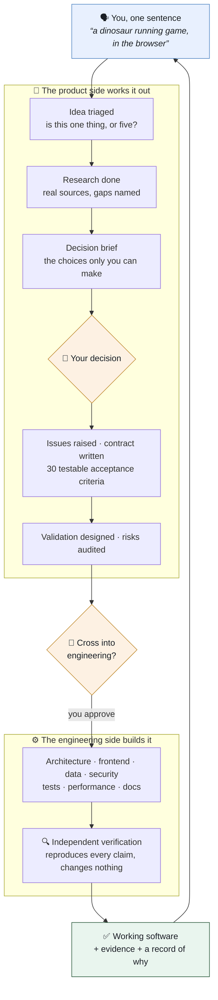
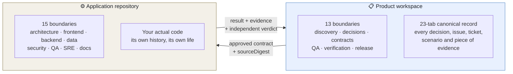

<div align="center">
  

  <br>

  <a href="https://github.com/sedwna/open-product-operations-os/actions/workflows/ci.yml"></a>
  
  
  
  

  <h3>You describe the product. A whole organisation builds it.</h3>

  <p>
    Not an app you install. An operating model your coding agent adopts —<br>
    so one person with an idea gets a product team, not an autocomplete.
  </p>

  <p>
    <a href="#start-here"><strong>Start in two minutes</strong></a>
    ·
    <a href="#what-actually-happens">See what happens</a>
    ·
    <a href="#what-you-decide-and-what-it-decides">Who decides what</a>
    ·
    <a href="docs/architecture/overview.md">Architecture</a>
  </p>
</div>

---

## The problem this solves

You can already ask an AI to write code. What you cannot ask it for is **everything around the
code** — someone to work out who this is for, someone to turn that into testable requirements,
someone to check the work independently, and a written trail explaining why every decision was made.

So you get code, quickly, and no idea whether it is the right code. Six weeks later nobody
remembers why a thing works the way it does, and the only record is a chat log.

**This gives your agent that missing organisation.** Twenty-eight defined roles across two sides —
product and engineering — each with authority over exactly one thing, each unable to certify its own
work, all writing to one record you can read.

<br>

## What actually happens

You clone this, hand it to Claude Code or Codex, and say **"start a product"**. Then you answer
three or four questions about *your product* — never about folders, flags, or configuration.

Here is a real shape of what follows.



Every box is a real team with a real boundary. The orange diamonds are the only places it stops for
you — and it stops *properly*, with the choice laid out and what each option costs.

<br>

## What you decide, and what it decides

This is the whole idea, so it is worth being exact.

| | **Yours, always** | **Its job, never yours** |
| --- | --- | --- |
| **Direction** | What to build, for whom, what matters more | Working out what that implies |
| **Trade-offs** | Which option, on what conditions | Laying the options out with their costs |
| **Crossing into code** | Whether implementation starts | Preparing everything it needs to |
| **Release** | Whether it ships | Proving whether it is ready |
| **Mechanics** | *nothing* | Folders, schemas, dependencies, hand-offs, evidence |

A decision you make is recorded **in your own words**, attributed to you, and travels with the work.
A model cannot record a disposition on your behalf — not as a policy, but because the surface that
writes decisions will not accept one that did not come from a person.

> [!NOTE]
> If it ever tells you to open a terminal to make a decision, that is a bug. Report it.

<br>

## Start here

```bash
git clone https://github.com/sedwna/open-product-operations-os.git
cd open-product-operations-os
```

Open Claude Code, Codex, or another capable agent **in that folder** and say:

> Set me up with a new product.

That is the whole instruction. The agent reads [`AGENTS.md`](AGENTS.md) — a runbook written for it,
not for you — and does the rest: checks your Node version, installs, creates and validates the
workspace, wires the connection, records your first idea, and routes it to the teams.

You end up with a working product workspace, a routed board, and the first decision waiting on you.

**Requirement:** Node.js 20 or newer. That is all.

<details>
<summary>Prefer to drive it yourself?</summary>

<br>

```bash
node ./src/cli.js init ./my-product --dry-run   # see every file first
node ./src/cli.js init ./my-product
node ./src/cli.js validate ./my-product
```

Runtime commands plan by default; `--apply` is always explicit. The
[runtime guide](docs/runtime/README.md) is the complete operating contract.

</details>

<br>

## The window you watch it through

Ask your agent for the panel and it renders **inside the conversation** — no second app, no
dashboard to keep open.

```
┌────────────────────────────────────────────────────────────┐
│  Phase: engineering              ● running                 │
│  ─────────────────────────────────────────────────────     │
│  ready 1   ·   in progress 2   ·   blocked 0   ·  done 7   │
│                                                            │
│  ⌾  WAITING ON YOU                                         │
│     “Per-workspace summary day, or one global default?”    │
│     Delivery Contract · TASK-0009                          │
│     ┌──────────────────────────────────────────────┐       │
│     │ why you decided it this way…                 │       │
│     └──────────────────────────────────────────────┘       │
│     [ approve ]  [ reject ]   conditions optional          │
│                                                            │
│  ✓ Discovery → ✓ Decision → ● Contract → ○ Build → ○ QA    │
└────────────────────────────────────────────────────────────┘
```

Teams have names, not codes. You see *the discovery team* and *the database team*, never `RB-03`
and `ENG-06`. Where work sits, what it is stuck behind, and whose it is to clear.

<br>

## Two organisations, one boundary

The product side and the engineering side live in **separate repositories with separate Git
histories**. They never read each other's working state. What crosses between them is a hashed
contract, and the receiving side verifies the hash before doing anything.



Your code repository keeps its own history and stays yours. It gains a namespace describing its
engineering boundaries — and adding that to a repository people rely on is your call, shown before
it happens.

<br>

## Why you can trust what it tells you

The failure mode of an AI doing product work is not bad code. It is **confident claims nobody
checked**. Six invariants exist to make that hard.

| Invariant | How it is held |
| --- | --- |
| 🚫 **Nobody certifies their own work** | Producer and verifier are different actors, and it is validated, not assumed |
| 🙋 **Product authority stays human** | Decisions are durable, attributed records; a model cannot write one for you |
| 🔍 **A claim without evidence is not done** | Evidence references are part of the contract, not a nicety |
| 📝 **A write is not trusted until read back** | Controlled writers compare the whole record after writing |
| 🧯 **Nothing external happens by accident** | Every adapter is off by default; every runtime action plans first |
| 🕰️ **History is never rewritten** | Corrections supersede; they do not erase |

Independent verification is a role that **reproduces** claims rather than reading them. It is
handed out last, it may change nothing, and the repository is hashed before and after — an edit
voids its own verdict.

<br>

## What is underneath

<details>
<summary><strong>The two role sets</strong></summary>

<br>

**Product side (13).** Coordination · idea and decision · discovery and research · experience and
journeys · issues and priority · delivery contract · validation design · risk and logic audit ·
quality and evidence · workbook integrity · readiness and release · independent verification ·
product-to-development bridge.

**Engineering side (15).** Coordination · solution architecture · frontend and accessibility ·
backend and API · client applications · database and storage · data, analytics and AI · platform,
cloud and network · security and privacy · quality engineering · reliability and performance ·
developer experience and delivery · SEO and discoverability · technical documentation · independent
engineering verification.

Each has an explicit `may` and `must_not`. A subagent doing a team's work has that team's authority
and no more.

</details>

<details>
<summary><strong>The control surface</strong></summary>

<br>

Everything runs over the Model Context Protocol, so the same setup serves Claude Code, Claude
Desktop, Codex, and any compliant host.

Read-only by default: **8 tools**, no write path exists at all. With `--allow-writes`: **19** —
recording intake, running cycles, taking and returning work on both sides, crossing into engineering
and back, and collecting your decisions.

Per-host setup, including what to do when nothing connects, is in
[connecting a host](docs/setup/connecting-a-host.md). The authority model is in the
[MCP control surface](docs/architecture/mcp-control-surface.md).

</details>

<details>
<summary><strong>Bringing in a project you have already started</strong></summary>

<br>

The repository is read and what the product already *is* gets derived from it — domains, journeys,
open issues, technical debt — with every derived row recording its source and staying an
**observation** until you accept it. Coverage is accounted for: every path is either assigned to a
boundary or excluded with a named reason, and the survey reports itself incomplete if not.

</details>

<details>
<summary><strong>Layout and maturity</strong></summary>

<br>

```text
src/          runtime, control surface, adapters, validators
templates/    canonical governance, roles, workbook, workflow contracts
schemas/      published validation contracts
examples/     a full worked example
docs/         architecture, security, migration, runtime guidance
```

```text
Current stage: Foundation
Public API stability: Not guaranteed
Recommended use: Evaluation and pilot projects
```

The package path validates syntax, clean-room identity, tests, portable hashes, a real packed
artifact, clean clone and archive behaviour, dependencies, licences, and an SBOM across three
operating systems and two Node versions. Passing automation is producer evidence; it is not an
independent release verdict, and the project does not claim to be stable.

</details>

<br>

## Reading map

| If you want to… | Read… |
| --- | --- |
| Get started | [Start here](START-HERE.md) |
| Connect Claude Code or Codex | [Connecting a host](docs/setup/connecting-a-host.md) |
| Understand ownership and separation | [Architecture overview](docs/architecture/overview.md) |
| Follow one event end to end | [Event lifecycle](docs/architecture/event-lifecycle.md) |
| Operate approvals, intake and cycles | [Runtime guide](docs/runtime/README.md) |
| See the authority model | [MCP control surface](docs/architecture/mcp-control-surface.md) |
| Set up the engineering side | [Development OS](docs/development/README.md) |
| Understand how the two sides sync | [Dual OS architecture](docs/architecture/dual-operating-system.md) |
| Work with the canonical record | [Workbook operating model](docs/workbook/operating-model.md) |
| Review the security position | [Security model](docs/security-model.md) |
| Connect external systems | [Provider adapters](docs/runtime/provider-adapters.md) |

## Contributing

Evidence-backed improvements are welcome. Start with [`CONTRIBUTING.md`](CONTRIBUTING.md), keep
changes inside an explicit role and write boundary, and never represent producer evidence as
independent certification.

<div align="center">
  <br>
  <strong>Open Product Operations OS</strong><br>
  Clear ownership · durable decisions · reproducible evidence
  <br><br>
  Apache License 2.0
</div>
