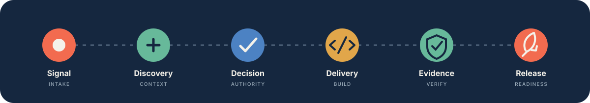
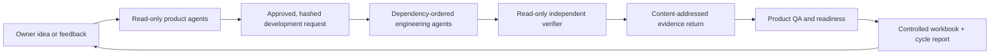

<div align="center">
  

  <br>

  <a href="https://github.com/sedwna/open-product-operations-os/actions/workflows/ci.yml"></a>
  
  
  
  

  <h3>A vendor-neutral operating system for evidence-backed product work.</h3>

  <p>
    Turn an unstructured signal into an owned decision, governed delivery,<br>
    reproducible evidence, independent verification, and a release you can explain.
  </p>

  <p>
    <a href="START-HERE.md"><strong>Start here</strong></a>
    ·
    <a href="docs/architecture/mcp-control-surface.md">Control surface</a>
    ·
    <a href="docs/runtime/README.md">Runtime guide</a>
    ·
    <a href="docs/architecture/overview.md">Explore the architecture</a>
    ·
    <a href="examples/fictional-saas/README.md">See the PineDesk example</a>
  </p>
</div>

---

## Product work should leave a trail

Most product systems hold fragments: an idea in chat, a decision in a meeting, a ticket in a
tracker, test evidence in a folder, and release status somewhere else. Open Product Operations OS
connects those fragments into one reconstructable chain.

<p align="center">
  
</p>

```text
source event
→ owned task
→ canonical artifact
→ operational state
→ read-back proof
→ independent verification
→ human disposition when required
```

If a link is missing, the system does not silently call the work complete.

## What you get

| Surface | What it gives you |
| --- | --- |
| **Interactive control tower** | A calm RTL workspace for tasks, decisions, intake, risks, evidence, roles, and release readiness |
| **13 role boundaries** | Explicit authority for discovery, decisions, delivery, QA, writes, verification, release, and development |
| **23-tab product workbook** | Portable CSV records spanning idea, discovery, issues, tickets, evidence, QA, lineage, and readiness |
| **Autonomous product factory** | A resumable idea → product analysis → engineering → product verification → report loop with live role and task visibility |
| **Development adapter** | A bounded handoff to an engineering agent or team through the dedicated development role |
| **Automation Center** | Live phase, role, task, event history, retry state, pause/resume controls, Codex or Claude Code readiness, and the latest cycle result |
| **Independent Development OS** | A 15-boundary engineering package for architecture, frontend, backend, database, data, infrastructure, network, security, QA, SRE, delivery, SEO, documentation, and verification |
| **Controlled writers** | Precondition checks, authorization, complete read-back, replay protection, and guarded rollback |
| **Provider boundary** | Disabled-by-default adapters for GitHub, GitLab, Jira, Linear, Azure DevOps, Sheets, Graph, and Airtable |
| **Portable proof** | Cross-host package checks, clean-clone/archive tests, SBOM generation, license checks, and secret scans |

## Two ways to watch and decide

There is one control plane and two windows onto it. Which you use depends on where you work, not on
what you are allowed to do — both read the same durable records, and neither is a second source of
truth.

| | The panel | The local dashboard |
| --- | --- | --- |
| **Where** | Inside your agent host, in the conversation | A browser, on a loopback address |
| **For** | Anyone driving the work through Claude, Codex, or another MCP host | Anyone who would rather not, and anyone without such a host |
| **Opens with** | `product_ops_panel` | `product-ops dashboard ./my-product --serve` |

The dashboard is generated from the same durable records that drive the control plane.

- **Snapshot mode** creates a self-contained RTL report you can open locally.
- **Live mode** serves the current project on a loopback address with search, filters, detail
  drawers, intake, human decisions, and control-plane execution.
- **Read-only is the default.** Live writes require an explicit authorization flag and a
  per-session local request token.
- **Hosted demos stay fictional.** Real project data and write authority never leave the local
  project boundary.

```text
# Create a safe snapshot
product-ops dashboard ./my-product --apply

# Open the interactive panel without write authority
product-ops dashboard ./my-product --serve

# Allow attributed local intake, decisions, and bounded control-plane cycles
product-ops dashboard ./my-product --serve --apply
```

Read the [runtime guide](docs/runtime/README.md) for the complete operating and safety contract.

## Run it from Claude or Codex

Point your coding agent at the project and supervise from inside the conversation. The control
surface speaks the Model Context Protocol, so the same setup serves Claude Code, Claude Desktop,
the ChatGPT desktop app, Codex CLI, and any compliant IDE.

`.mcp.json` for Claude Code, or `.codex/config.toml` for Codex:

```json
{
  "mcpServers": {
    "product-ops": {
      "command": "npx",
      "args": ["-y", "--package=open-product-operations-os", "product-ops-mcp", "--project", "."]
    }
  }
}
```

Read-only is the default. Add `--allow-writes` when you want the owner to be able to record intake,
run a cycle, and settle human gates from the conversation.

Then, in the session:

| Ask for | What happens |
| --- | --- |
| `/product-ops:start` | Walks you from an empty workspace to a running one, with or without an existing application |
| `/product-ops:take-command` | Puts the agent in the coordinator seat with the full operating brief |
| `/product-ops:what-needs-me` | Every gate waiting on you, with its risks and evidence |
| **the panel** | `product_ops_panel` renders the control tower inline: both teams, the hand-off chain, and a box to write your decision in |

The panel shows the organisation, not the schema — named teams on both sides, where each piece of
work currently sits, and what is waiting on you. Deciding is yours: the surface collects your
reasoning and attributes the record to you.

Read the [MCP control surface](docs/architecture/mcp-control-surface.md) for the authority model.

## Setting a workspace up

Ask your agent for `/product-ops:start`. It works through the setup with you rather than running
ahead, and takes one of two paths.

| You have | What happens |
| --- | --- |
| **An existing project** | The repository is read, what the product already is gets derived from it — domains, journeys, open issues, technical debt — and the boards are seeded. Every derived row records its source and stays an observation until you accept it. |
| **Only an idea** | The idea is recorded as intake and the product teams begin analysing it. |

Adding the Development Operations OS namespace to an application repository someone already relies
on is the owner's call: the agent shows what it will create and waits.

The [Autonomous Product Factory architecture](docs/automation/README.md) documents the implemented
continuous loop: read-only product agents, dependency-ordered engineering workstreams, durable
leases and retries, content-addressed evidence return, controlled workbook insertion, product
verification, reports, and separate Git branches. Production release and destructive actions remain
separately gated.

## Five-minute manual start

**Requirement:** Node.js 20 or newer.

```text
# Preview every generated file
node ./src/cli.js init ./my-product --dry-run

# Create and validate the project
node ./src/cli.js init ./my-product
node ./src/cli.js validate ./my-product

# Open the product-owner dashboard
node ./src/cli.js dashboard ./my-product --serve
```

Then add a safe local intake and inspect the next workflow cycle:

```text
node ./src/cli.js intake ./my-product --file ./idea.json --apply
node ./src/cli.js operate ./my-product
```

> [!TIP]
> Runtime commands plan by default. Add the explicit apply flag only after reviewing the planned
> action and confirming the correct project boundary.

## Architecture at a glance



The repository is intentionally layered:

```text
src/          executable initializer, validator, runtime, adapters, and dashboard
templates/    canonical governance, role, workbook, workflow, and release contracts
schemas/      published validation contracts
examples/     fictional end-to-end evidence
docs/         architecture, security, migration, runtime, and verification guidance
```

## Development integration

For full engineering operation, initialize the independent
[Open Development Operations OS](docs/development/README.md) inside the application repository.
It uses versioned request/result contracts and content-addressed receipts to synchronize with this
Product Operations repository without merging their authority or canonical state.

```text
# Give the application its engineering boundaries
development-os init ./my-application --dry-run
development-os init ./my-application
development-os validate ./my-application

# Then tell the product workspace which repository it operates
product-ops link ./my-product --application ./my-application --apply
```

Until that link exists the workspace has no engineering side: adoption has nothing to read and the
coordinator has nothing to coordinate. Linking names the repository and stops there — executors and
the coordinator stay disabled until separately enabled.

`/product-ops:start` runs these initialization and validation commands for you when you confirm
them; the commands above are there for scripting, CI, or when you prefer direct control. Specialist
executors stay disabled until separately configured, tested, and authorized either way.

The command-runner adapter remains available as a lower-level bounded integration.

Development is a governed adapter, not an implicit side effect. The development role receives an
approved delivery contract, acceptance criteria, dependencies, evidence, a validation recipe, and
a write boundary. It returns an implementation reference, test evidence, environment state, known
risks, and development-owned status.

```text
product-ops development ./my-product --task TASK-RB-13-...        # plan
product-ops development ./my-product --task TASK-RB-13-... --apply # execute
```

An arbitrary coding command is **not** an operating-system sandbox. Run untrusted development
agents inside a separately constrained worker, container, or virtual machine.

## Safety is part of the product

| Invariant | Enforcement |
| --- | --- |
| Producers cannot certify their own material claims | Distinct producer and verifier actors are validated |
| Humans retain product and risk authority | Durable, attributed approval records gate protected transitions |
| External writes are exceptional | Adapters are disabled by default and runtime actions plan first |
| A write is not trusted until read back | Controlled writers require complete post-write comparison |
| Credentials stay outside Git | Whole-tree secret scanning and named environment-variable references |
| History remains explainable | Operational records preserve lineage; corrections supersede rather than erase |

See the [security model](docs/security-model.md) and
[public release gates](docs/publication-gates.md) before enabling real providers.

<details>
<summary><strong>Current maturity and verification evidence</strong></summary>

<br>

```text
Current stage: Foundation
Public API stability: Not guaranteed
Recommended use: Evaluation and pilot projects
```

The project is not yet declared stable. The latest runtime branch introduced the interactive
control plane and extended the suite beyond the original foundation proof. Historical producer and
independent-verifier records remain under [`docs/verification/`](docs/verification/) and follow the
documented [supersession policy](docs/verification/evidence-supersession-and-redaction.md).

The package path validates syntax, clean-room identity, tests, portable hashes, a real packed
artifact, clean clone/archive behavior, dependencies, licenses, and an SBOM. Passing automation is
producer evidence; it is not a substitute for an independent release verdict.

</details>

<details>
<summary><strong>What the initializer generates</strong></summary>

<br>

- the canonical 13-role registry with distinct default actors;
- governance, ownership, routing, and communication contracts;
- a shared task board and first owned discovery task;
- the canonical 23-tab CSV workbook;
- local public schemas for handoffs, evidence, approvals, development results, providers, and
  controlled writes;
- disabled Git, spreadsheet, development, and external-provider adapters;
- runtime stores for intake, approvals, receipts, metrics, and dashboard output;
- a configuration wizard, migration contract, and synthetic example project.

Forced regeneration preserves valid configuration and operational rows. It rejects path escapes,
links, unsafe replacement races, and ambiguous recovery states.

</details>

## Reading map

| If you want to… | Read… |
| --- | --- |
| Bootstrap a product | [Start here](START-HERE.md) |
| Understand ownership and separation | [Architecture overview](docs/architecture/overview.md) |
| Follow one event end to end | [Event lifecycle](docs/architecture/event-lifecycle.md) |
| Operate the dashboard and agents | [Runtime guide](docs/runtime/README.md) |
| Read the control plane from Claude or Codex | [MCP control surface](docs/architecture/mcp-control-surface.md) |
| Connect a development agent | [Development runner](docs/runtime/development-runner.md) |
| Initialize the complete engineering system | [Development OS](docs/development/README.md) |
| Understand Product/Development synchronization | [Dual OS architecture](docs/architecture/dual-operating-system.md) |
| Review the latest production-readiness security audit | [Security review](docs/verification/2026-08-02-production-readiness-security-review.md) |
| Review the first full-cycle product-test corrections | [Root-cause remediation](docs/verification/2026-08-02-product-cycle-root-cause-remediation.md) |
| Connect external systems | [Provider adapters](docs/runtime/provider-adapters.md) |
| Work with the workbook | [Workbook operating model](docs/workbook/operating-model.md) |
| Evaluate publication readiness | [Public release gates](docs/publication-gates.md) |

## Contributing

The repository welcomes evidence-backed improvements. Begin with
[`CONTRIBUTING.md`](CONTRIBUTING.md), keep changes inside an explicit role and write boundary, and
never represent producer evidence as independent certification.

<div align="center">
  <br>
  <strong>Open Product Operations OS</strong><br>
  Clear ownership · durable decisions · reproducible evidence
  <br><br>
  Apache License 2.0
</div>
