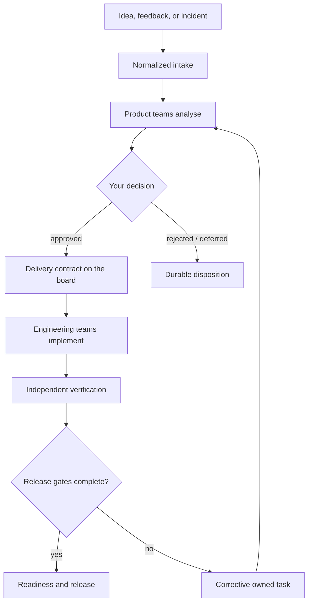

<div align="center">

# Start here

### Give your coding agent a product organisation to run.

**2 entry paths · 28 named teams · 23 workbook tabs · 1 reconstructable product trail**

[Install](#install) · [Set the workspace up](#set-the-workspace-up) · [Run the loop](#run-the-loop) ·
[Direct command line](#the-direct-command-line) · [Connect development](#development-integration)

For the governed path from an idea to continuously claimed engineering work, read the
[Autonomous Product Factory architecture](docs/automation/README.md).

</div>

---

## The short way

Clone the repository, open your coding agent in it, and say **"set me up with a new product."**

It reads [`AGENTS.md`](AGENTS.md) and does the whole thing — installs, creates the workspace,
configures it, writes the MCP entry, records your first idea, routes the board. It asks you three or
four questions about your product and none about mechanics.

The rest of this page is what it does on your behalf, for when you want to know or do it yourself.

## What this is

This repository is not an application you install. It is an operating model your coding agent
adopts: role boundaries, a task board, human decision gates, and an evidence chain, exposed to the
host over the Model Context Protocol.

You stay the product owner. The agent becomes the coordinator of two organisations — a product side
that owns meaning and priority, and an engineering side that owns implementation and technical
evidence — and neither certifies the other's claims.

```text
you ──▶ your agent host ──MCP──▶ this operating model ──▶ your product repository
```

## Install

Node.js 20 or newer is the only prerequisite.

> [!IMPORTANT]
> This package is **not published to npm yet**, so `npx --package=open-product-operations-os`
> returns a 404. Clone the repository and point your host at the clone; the entries below do that.
> When the package is published, an `npx` form will replace them.

```text
git clone https://github.com/sedwna/open-product-operations-os.git
cd open-product-operations-os
npm ci
```

**Claude Code** — `.mcp.json` at the root of your product-operations workspace, with an absolute
path to the clone:

```json
{
  "mcpServers": {
    "product-ops": {
      "command": "node",
      "args": ["/absolute/path/to/open-product-operations-os/src/mcp/server.js", "--project", "."]
    }
  }
}
```

**Codex** — `.codex/config.toml`, loaded only for trusted projects:

```toml
[mcp_servers.product_ops]
command = "node"
args = ["/absolute/path/to/open-product-operations-os/src/mcp/server.js", "--project", "."]
```

The same entry serves Claude Code, Claude Desktop, the ChatGPT desktop app, Codex CLI, the Codex IDE
extension, and any compliant host.

Read-only is the default posture: the planning and human-authority tools are not registered at all
unless you add `--allow-writes`. Start without it, look around, and add it when you want the
workspace to record intake, run cycles, and settle decisions.

## Set the workspace up

In your session, ask for `/product-ops:start`. The agent works through it with you rather than
running ahead, and takes one of two paths.

| You have | What happens |
| --- | --- |
| **An existing project** | The agent reads the repository, derives what the product already is — domains, journeys, open issues, technical debt — and seeds the boards from it. Every derived row records where it came from and stays an observation until you accept it. |
| **Only an idea** | The agent records the idea as intake and the product teams begin analysing it. |

Either way you finish with a validated workspace, a populated board, and the control panel open.

> [!IMPORTANT]
> Do not add credentials, private URLs, customer data, production payloads, or secret values to the
> project configuration. Adapters reference named runtime aliases instead.

## Run the loop



Ask for these when you need them. Type `/` and pick from the list — the exact spelling differs
between the CLI and the desktop app, so picking beats typing. Asking in plain words works too.

| Ask for | What you get |
| --- | --- |
| `take-command` | Puts the agent in the coordinator seat with the full operating brief |
| `brief` | Where the cycle stands, what moved, what is stuck |
| `what-needs-me` | Every gate waiting on you, with its risks and evidence |
| `explain-blocked` | The dependency chain from a stuck task to its root cause |
| **the panel** | `product_ops_panel` renders the control tower inline: both organisations, the hand-off chain, and a box to write your decision in |

Nothing under `/`? The server has not connected — see
[connecting a host](docs/setup/connecting-a-host.md).

The panel shows teams, not contract identifiers. You see *the discovery team* and *the database
team*, not `RB-03` and `ENG-06`. Deciding stays yours: the surface collects your reasoning and
attributes the record to you, and a model cannot supply a disposition on your behalf.

## Human authority

The product owner keeps authority over:

- product direction and priority;
- risk acceptance;
- real-money or provider-backed operations;
- credentials and sensitive access;
- destructive or irreversible actions;
- governance and role-lifecycle changes;
- final acceptance of user-visible behavior.

Everything else should be automated or prepared as an exact, reviewable artifact.

## The direct command line

The MCP surface is the primary way to work. The command line remains available for scripting, CI,
and anyone who prefers it — it operates the same canonical records.

```text
# Preview first, then create and validate
node ./src/cli.js init ./my-product --dry-run
node ./src/cli.js init ./my-product
node ./src/cli.js validate ./my-product

# Record an idea and inspect the next cycle before running it
node ./src/cli.js intake ./my-product --file ./idea.json --apply
node ./src/cli.js operate ./my-product
node ./src/cli.js operate ./my-product --apply
```

A minimal intake file:

```json
{
  "type": "new_idea",
  "title": "Let users choose their weekly summary day",
  "description": "Workspace coordinators need control over when the summary arrives.",
  "source": "synthetic discovery note",
  "priority": "P2"
}
```

> [!TIP]
> Runtime commands plan by default. Add `--apply` only after reviewing the planned action and
> confirming the correct project boundary.

## Development integration

The engineering side is a separate operating model with its own Git history. It is never a
subfolder or a mutable database of the product repository.

Two steps: give the application its engineering boundaries, then tell the product workspace which
repository it operates.

```text
# 1. In the application repository
development-os init ./my-application --dry-run
development-os init ./my-application
development-os validate ./my-application

# 2. Back in the product workspace
product-ops link ./my-product --application ./my-application
product-ops link ./my-product --application ./my-application --apply
```

Until the link exists, this workspace has no engineering side: adoption has nothing to read, the
coordinator has nothing to coordinate, and the panel shows product teams only.

Linking says which repository the workspace is about — nothing more. Executors and the autonomous
coordinator stay disabled, because naming a repository is not the same act as authorising agents to
work inside it. Re-linking a moved repository keeps whatever you had already enabled.

This creates 15 engineering authority boundaries and quality gates covering architecture, frontend,
accessibility, backend, APIs, clients, database and migrations, data and AI, cloud and network,
security and privacy, QA, SRE and performance, delivery, SEO, documentation, and independent
verification. Read the [Development OS guide](docs/development/README.md).

Adding that namespace to a repository someone already relies on is the owner's call. The agent shows
what it will create and waits.

The development boundary receives:

```text
approved delivery contract
acceptance criteria
dependencies and evidence
validation recipe
write boundary
expected completion signal
```

It returns:

```text
implementation reference
verification evidence
environment or deployment state
known risks
development-owned status
```

Use a constrained worker, container, or virtual machine for untrusted coding agents. A command
adapter is not an operating-system sandbox.

## Completion means more than "done"

An event closes only when every required output has an owner, canonical artifacts are committed,
operational state was updated through an authorized writer, live state was read back, evidence is
reproducible, an independent role verified the claims, required human acceptance is recorded, and
downstream readiness is recalculated.

> [!NOTE]
> A control-plane receipt is an execution signal. It is not a release verdict and cannot replace
> independent verification.

## Where to go next

| Goal | Guide |
| --- | --- |
| Understand the control surface and its authority model | [MCP control surface](docs/architecture/mcp-control-surface.md) |
| Operate approvals, intake, metrics, and reports | [Runtime guide](docs/runtime/README.md) |
| Understand the system boundaries | [Architecture overview](docs/architecture/overview.md) |
| Study the complete event lifecycle | [Event lifecycle](docs/architecture/event-lifecycle.md) |
| Connect an engineering agent | [Development runner](docs/runtime/development-runner.md) |
| Enable a provider safely | [Provider adapters](docs/runtime/provider-adapters.md) |
| Walk through a finished fictional chain | [PineDesk example](examples/fictional-saas/README.md) |
