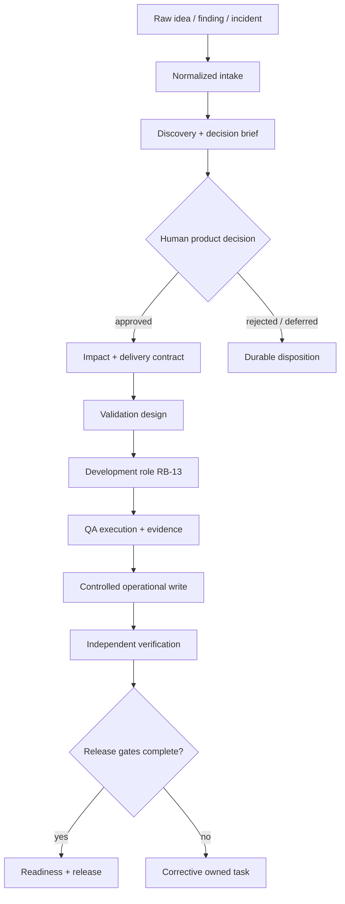

<div align="center">

# Start here

### Launch an evidence-backed product operating model without replaying chat history.

**5 inputs · 13 role boundaries · 23 workbook tabs · 1 reconstructable product trail**

[Launch in one click](#the-easiest-path) · [Create manually](#1-create-the-project) · [Run the first cycle](#3-run-the-first-cycle) ·
[Open the dashboard](#4-open-the-control-tower) · [Connect development](#development-integration)

</div>

---

## The easiest path

After cloning, open one file and let the graphical wizard do the rest:

| Your computer | Open |
| --- | --- |
| Windows | [`launchers/windows/OpenProductOS.exe`](launchers/windows/OpenProductOS.exe) |
| macOS | [`launchers/macos/OpenProductOS.command`](launchers/macos/OpenProductOS.command) |
| Linux | [`launchers/linux/OpenProductOS.desktop`](launchers/linux/OpenProductOS.desktop) |

It asks for the workspace and folder names, product details, and—if you want—the first idea. It then
installs locked dependencies, creates independent operations and application repositories, records
the idea, runs the first cycle, validates the result, and opens the local RTL control tower.

The development agent remains disabled until you explicitly configure and authorize that separate
boundary. Read the [one-click guide](docs/onboarding/one-click.md) for platform notes and recovery.

## Before you begin

Bring five product-level answers. You can refine them later without weakening the operating model.

| Input | A useful first answer |
| --- | --- |
| **Product name** | The stable name used in project records |
| **Vision** | The outcome this system should help users achieve |
| **Target users** | The primary people and roles affected by decisions |
| **Environments** | Local, test, staging, production, or your bounded equivalents |
| **Development adapter** | The engineering agent, team, or disabled placeholder receiving approved work |

Optional integrations include an existing application, issue tracker, spreadsheet, design system,
analytics source, and release process.

> [!IMPORTANT]
> Do not add credentials, private URLs, customer data, production payloads, or secret values to the
> project configuration. Adapters reference named runtime aliases instead.

## The operating model in one picture



Product specialists author meaning. The control plane routes work. Independent controls verify
claims. The task board and versioned artifacts—not private chat—are the coordination bus.

## 1. Create the project

Node.js 20 or newer is required. From this repository:

```text
# Preview first
node ./src/cli.js init ./my-product --dry-run

# Create the project
node ./src/cli.js init ./my-product
```

The initializer validates lexical and resolved paths, generates canonical role and workbook
contracts, creates the first owned task, and leaves every external adapter disabled.

## 2. Validate the foundation

```text
node ./src/cli.js validate ./my-product
```

A valid result confirms the bounded project structure, role separation, routing references, task
identities, protected fields, generated files, and whole-tree secret scan.

## 3. Run the first cycle

Create a small JSON intake file:

```json
{
  "type": "new_idea",
  "title": "Let users choose their weekly summary day",
  "description": "Workspace coordinators need control over when the summary arrives.",
  "source": "synthetic discovery note",
  "priority": "P2"
}
```

Then record it and inspect the scheduler plan:

```text
node ./src/cli.js intake ./my-product --file ./idea.json --apply
node ./src/cli.js operate ./my-product
```

If the plan is correct, execute one bounded cycle:

```text
node ./src/cli.js operate ./my-product --apply
```

## 4. Open the control tower

The most useful first view is the local, read-only interactive dashboard:

```text
node ./src/cli.js dashboard ./my-product --serve
```

It brings tasks, decisions, intake, risks, evidence coverage, release gates, and role activity into
one RTL workspace. Nothing is mutated in this mode.

When the configured human owner is ready to record intake or an attributed decision:

```text
node ./src/cli.js dashboard ./my-product --serve --apply
```

The server binds only to the loopback interface. Mutations require the active local session token;
the dashboard never enables development execution or external providers implicitly.

## Human authority

The product owner keeps authority over:

- product direction and priority;
- risk acceptance;
- real-money or provider-backed operations;
- credentials and sensitive access;
- destructive or irreversible actions;
- governance and role-lifecycle changes;
- final acceptance of user-visible behavior.

Everything else should be automated or prepared as an exact, reviewable artifact.

## Development integration

For a complete engineering operating model, initialize the application repository separately:

```text
development-os init ./my-application --dry-run
development-os init ./my-application
development-os validate ./my-application
```

This creates 15 engineering authority boundaries and quality gates covering architecture,
frontend, accessibility, backend, APIs, clients, database and migrations, data and AI, cloud and
network, security and privacy, QA, SRE and performance, delivery, SEO, documentation, and
independent verification. Read the [Development OS guide](docs/development/README.md).

The development role receives:

```text
approved delivery contract
acceptance criteria
dependencies and evidence
validation recipe
write boundary
expected completion signal
```

It returns:

```text
implementation reference
verification evidence
environment or deployment state
known risks
development-owned status
```

```text
# Plan the handoff
node ./src/cli.js development ./my-product --task TASK-RB-13-...

# Execute only after the adapter and task are explicitly eligible
node ./src/cli.js development ./my-product --task TASK-RB-13-... --apply
```

Use a constrained worker, container, or virtual machine for untrusted coding agents. The command
adapter itself is not an operating-system sandbox.

## Completion means more than “done”

An event closes only when every required output has an owner, canonical artifacts are committed,
operational state was updated through an authorized writer, live state was read back, evidence is
reproducible, an independent role verified the claims, required human acceptance is recorded, and
downstream readiness is recalculated.

> [!NOTE]
> A control-plane receipt is an execution signal. It is not a release verdict and cannot replace
> independent verification.

## Where to go next

| Goal | Guide |
| --- | --- |
| Operate approvals, intake, metrics, and dashboard | [Runtime guide](docs/runtime/README.md) |
| Understand the system boundaries | [Architecture overview](docs/architecture/overview.md) |
| Study the complete event lifecycle | [Event lifecycle](docs/architecture/event-lifecycle.md) |
| Connect an engineering agent | [Development runner](docs/runtime/development-runner.md) |
| Enable a provider safely | [Provider adapters](docs/runtime/provider-adapters.md) |
| Walk through a finished fictional chain | [PineDesk example](examples/fictional-saas/README.md) |
