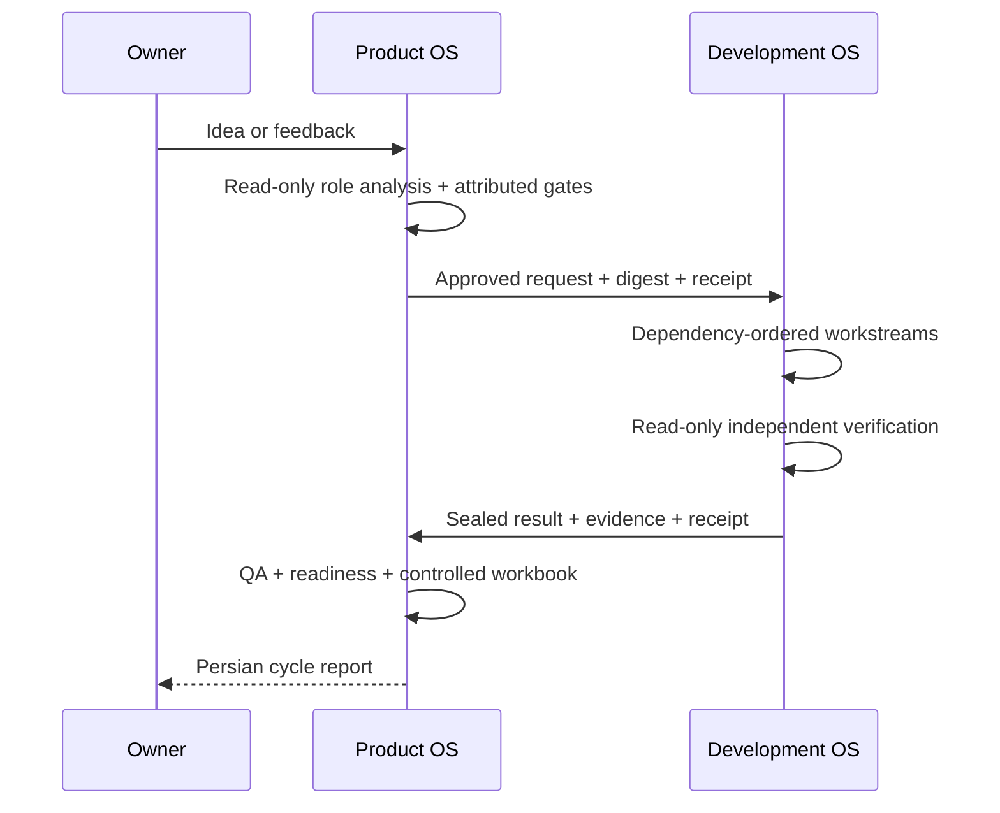

# Dual operating-system architecture

## Why two systems

Product work and engineering work have different authority, evidence, and failure modes. Combining
them into one mutable board makes it easy for a technical status to masquerade as product
acceptance—or for a product decision to silently become an implementation instruction.

Open Product Operations OS and Open Development Operations OS therefore remain independently
initializable and independently validatable.

```text
Product repository                         Application repository
------------------                         ----------------------
intent and priority                        code and architecture
acceptance criteria                        database and infrastructure
product evidence                           engineering evidence
human dispositions                         technical revisions
RB-01..RB-13 boundaries        <=>          ENG-01..ENG-15 boundaries
```

## Synchronization protocol

1. Product Operations prepares a development request from an eligible `RB-13` task.
2. The request carries approval attribution, acceptance criteria, non-functional requirements,
   impact domains, validation expectations, source revision, and write boundaries.
3. Export records the exact SHA-256 digest and a durable receipt.
4. Development validates the request and creates a deterministic multi-discipline plan.
5. Engineering producers implement and capture gate evidence at an exact revision.
6. A distinct `ENG-15` actor reproduces the material claims.
7. Development emits a result tied to the original request digest and implementation revision.
8. Product Operations validates and stores the result, copies verified evidence into its own
   content-addressed evidence boundary, and runs downstream QA, verification, readiness, and report
   roles without inventing product acceptance.
9. Each repository keeps a separate cycle branch and commit. Neither repository becomes a subfolder
   or mutable database of the other.

Replay with identical contracts is idempotent. Content drift under an existing identity is
rejected rather than silently overwriting history.



## Failure behavior

- Missing product approval: no export.
- Unresolved product dependency: no export.
- Invalid or secret-bearing contract: no synchronization.
- Path outside the configured engineering boundary: no plan.
- Missing database, security, SEO, accessibility, or reliability gate when applicable: no complete
  result.
- Producer equals verifier: no complete result.
- Digest or task mismatch: no import.
- Production authorization missing: engineering evidence may be complete, but deployment remains
  blocked.

## Extensibility

Provider adapters may later transport the same contracts through GitHub, GitLab, Azure DevOps,
Jira, Linear, queues, or hosted agents. Providers do not change the authority model: the hashed
canonical contracts and receipts remain the source of synchronization truth.
