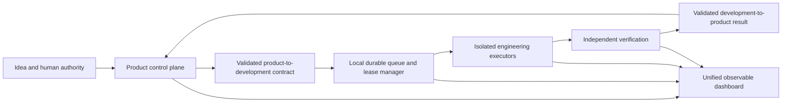

# Autonomous Product Factory

The Autonomous Product Factory is the governed execution layer that turns a submitted idea into
observable product and engineering work. It does not merge Product Operations OS and Development
Operations OS. Each keeps its own authority, records, roles, and Git history. Automation connects
them through validated, content-addressed contracts.

## Product promise

After one-click onboarding, the dashboard must answer five questions without requiring the user to
inspect files or terminals:

1. What is happening now?
2. Which role created each task?
3. Which executable agent, if any, claimed it?
4. What evidence has been produced?
5. What is waiting for human authority?

"Configured", "authenticated", "executing", and "completed" are separate states. The interface must
never describe an installed provider as a running agent.

## Architecture

The intended runtime has four layers:

- **Canonical control plane:** versioned configuration, task boards, approvals, contracts, evidence,
  receipts, and Git history remain the durable source of truth.
- **Local orchestration index:** SQLite will provide queues, leases, heartbeats, retry state, and fast
  dashboard queries. It is reconstructable from canonical records and is not the source of truth.
- **Execution plane:** provider adapters invoke Codex first, with a provider-neutral boundary for
  future executors. Every engineering role has a bounded workstream and attributed actor identity.
- **Observation plane:** the local dashboard displays provider readiness, contract transfer, task
  claims, execution events, evidence, failures, retries, and human gates.

## Codex readiness contract

One-click onboarding checks these states in order:

| State | Meaning | Allowed action |
| --- | --- | --- |
| Not installed | No Codex CLI candidate was found | Offer installation of the official package |
| Installed but unusable | A desktop alias or binary exists but cannot execute | Install or select a usable CLI |
| Login required | The CLI executes but `codex login status` fails | Open the official browser login flow |
| Provider ready | CLI version and login status both pass | Configure and enable bounded executors |
| Capability proven | A real workstream completes successfully | Permit the scheduler to continue |

The CLI can report the active authentication method. It does not provide a stable contract for
reading a user's exact ChatGPT subscription tier. Therefore the system records authentication and
proves practical entitlement through the first real bounded execution. It never stores credentials
inside either project.

## Task ownership and claiming

The continuous orchestrator will use an atomic lease rather than "first process to read a CSV".
A claim contains the task or workstream identifier, actor identifier, run identifier, lease expiry,
heartbeat time, attempt number, and canonical revision. Only dependency-ready work can be claimed.
An expired lease is recoverable; a completed workstream is immutable and cannot be executed twice
without an explicit superseding contract.

The default execution sequence is:

1. Product intake is normalized and deduplicated.
2. Product roles produce evidence and decisions through the deterministic control tower.
3. Human gates are requested when policy requires them.
4. The development boundary exports a schema-validated, hashed request.
5. Development planning creates dependency-aware workstreams.
6. Specialist executors claim ready workstreams with bounded concurrency.
7. Independent verification evaluates evidence and quality gates.
8. A sealed result returns to Product Operations OS.
9. Product state and the unified dashboard are refreshed.

## Non-negotiable safety boundaries

- No credential material is written to Git, contracts, task boards, logs, or the local index.
- Production deployment, destructive database changes, spending, and external publication require
  an explicit human gate unless a future policy deliberately and visibly narrows that rule.
- Executors receive the smallest practical write boundary and run in a dedicated container, virtual
  machine, or isolated hosted worker for untrusted work.
- A producer cannot independently certify its own material result.
- Every external mutation needs an idempotency key, a receipt, and read-back verification.
- The dashboard may control local execution only on loopback with session authorization and CSRF
  protection.

## Delivery stages

### Stage 1 — truthful connection status (implemented)

- Detect installed, executable, authenticated, and ready Codex states separately.
- Offer official CLI installation and browser authentication during one-click onboarding.
- Configure and enable all engineering role executors only after readiness passes.
- Persist a credential-free automation status record.
- Display the actual state and current limitation in the dashboard Automation Center.

### Stage 2 — durable continuous orchestrator

- Add the reconstructable SQLite index, queue, leases, heartbeats, bounded concurrency, retries, and
  crash recovery.
- Add start, pause, drain, resume, and stop controls.
- Stream factual run events to the dashboard.

### Stage 3 — automatic Product-to-Development bridge

- Generate development requests from eligible product cards.
- Transfer and acknowledge contracts automatically.
- Plan workstreams, update both task boards, and return verified results without manual file copying.

### Stage 4 — production engineering loop

- Add isolated executor pools, branch/worktree allocation, testing and security gates, review,
  database migration policy, observability, SEO, accessibility, performance, release evidence, and
  CI provider adapters.
- Keep production release behind explicit human authority.

### Stage 5 — reliability and scale

- Add resource budgets, rate and quota backoff, provider failover, audit export, signed provenance,
  multi-user coordination, and disaster-recovery drills.

## Current boundary

Stage 1 connects authenticated Codex executors to engineering roles, but it intentionally reports
`continuousOrchestrator: false`. Until Stage 2 is implemented, a configured executor does not claim
work continuously and each workstream still requires an explicit execution command. This distinction
is displayed in the dashboard so users are never told that building has started when it has not.
