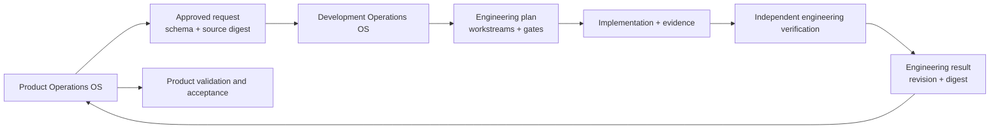

# Open Development Operations OS

Open Development Operations OS is the independent engineering half of the system. It can live in
an application repository without copying the Product Operations workbook, product decisions, or
human product authority. The two systems exchange immutable, schema-validated, content-addressed
contracts.

## Responsibility split

| Product Operations owns | Development Operations owns |
| --- | --- |
| Problem, outcome, priority, and scope | Implementation method and technical decomposition |
| Acceptance criteria and product constraints | Code, architecture, database, infrastructure, and engineering evidence |
| Human product and risk decisions | Factual build, test, revision, and environment state |
| Product validation and final acceptance | Engineering quality gates and independent technical verification |

Neither side writes the other side's claims. A synchronization receipt proves which exact contract
crossed the boundary.

## Architecture



The application repository remains the development source of truth. The product-operations
repository remains the product source of truth. Chat history, dashboards, and provider tickets are
views or transport—not authority.

## Fifteen engineering boundaries

| Role | Boundary |
| --- | --- |
| `ENG-01` | Engineering coordination and dependencies |
| `ENG-02` | Solution architecture and technical decisions |
| `ENG-03` | Frontend, design-system integration, RTL, and accessibility |
| `ENG-04` | Backend, APIs, integration, and messaging |
| `ENG-05` | Mobile and desktop clients |
| `ENG-06` | Database, storage, search, cache, migrations, backup, and recovery |
| `ENG-07` | Data, analytics, and AI |
| `ENG-08` | Platform, cloud, network, DNS, CDN, infrastructure, and cost |
| `ENG-09` | Security, identity, privacy, compliance, dependencies, and supply chain |
| `ENG-10` | Quality engineering and test automation |
| `ENG-11` | SRE, observability, performance, resilience, incidents, and disaster recovery |
| `ENG-12` | Developer experience, build, continuous delivery, release, and rollback mechanics |
| `ENG-13` | Technical SEO and public-web discovery |
| `ENG-14` | Technical documentation, runbooks, and knowledge continuity |
| `ENG-15` | Independent engineering verification |

Actors are configurable, but role boundaries are canonical. A material producer and `ENG-15`
verifier must be distinct.

## Start the engineering package

```text
development-os init ./my-application --dry-run
development-os init ./my-application
development-os validate ./my-application
```

Initialization is namespaced. It creates `development-os.config.json`, `DEVELOPMENT.md`,
`engineering/`, and `.development-os/`; it does not rewrite application source files.

## Synchronize an approved request

Product Operations first validates and exports an approved `RB-13` task:

```text
product-ops development-export ./my-product-ops --task TASK-ID --file ./request.json
product-ops development-export ./my-product-ops --task TASK-ID --file ./request.json --apply
```

Development imports the exported contract and produces a deterministic plan:

```text
development-os plan ./my-application --request ./exported-request.json
development-os plan ./my-application --request ./exported-request.json --apply
```

The planner always activates coordination, architecture, security, quality engineering,
documentation, and independent verification. It adds specialist workstreams and gates for every
declared impact. A database impact, for example, adds migration, compatibility, query/index,
backup, restore, capacity, and rollback evidence.

Each role also has a disabled-by-default specialist executor. After configuring an executor to
launch an externally isolated worker, one dependency-ready workstream can be previewed and run:

Configure the official Codex non-interactive preset for one role or every role. Setup is a dry run
unless `--apply` is present. Configuration remains disabled unless `--enable` is also present, and
activation is refused until the read-only doctor succeeds:

```text
development-os executor-setup ./my-application --provider codex --role ENG-04
development-os executor-setup ./my-application --provider codex --role all --apply
development-os executor-doctor ./my-application --role all
development-os executor-setup ./my-application --provider codex --role all --enable --apply
```

The preset uses the supported non-interactive command shape:

```text
codex exec --ephemeral --ignore-user-config --sandbox workspace-write \
  --output-schema engineering/schemas/engineering-workstream-run.schema.json \
  --output-last-message .development-os/runs/result.raw.json
```

Its prompt reads the generated `{inputFile}`, applies only the assigned workstream, and returns the
`engineering-workstream-run` contract. Product agents and `ENG-15` use a read-only sandbox;
implementation roles use workspace-write. The coordinator rejects final changes outside the
configured allowed paths or inside prohibited paths and seals every accepted run to the final
content digest. The setup stores no credential. Codex authentication stays outside
`development-os.config.json`.

For a locally installed adapter that already emits the same JSON contract on standard output:

```text
development-os executor-setup ./my-application --provider command --role ENG-07 --executable ./tools/engineering-adapter --argument {inputFile}
development-os executor-doctor ./my-application --role ENG-07
development-os executor-setup ./my-application --provider command --role ENG-07 --executable ./tools/engineering-adapter --argument {inputFile} --enable --apply
```

Arguments are passed directly with shell execution disabled. The doctor resolves the executable
without invoking it, checks the contained working directory, validates the output schema and
placeholder contract, and performs no writes. A successful doctor proves configuration readiness;
it does not prove process containment.

> **Isolation warning:** `external-required` is a contract, not a host sandbox. Run every executor
> in a dedicated container, virtual machine, or isolated hosted worker. Never attach production
> credentials, production data, or authority for destructive database operations.

After configuration, one dependency-ready workstream can be previewed and run:

```text
development-os execute ./my-application --plan ENGPLAN-ID --workstream WS-01
development-os execute ./my-application --plan ENGPLAN-ID --workstream WS-01 --apply
```

The runner never delegates argument arrays to a command shell, forwards only allowlisted
environment variables, validates the returned schema and actor identity, and stores immutable run
artifacts. It does not claim that a JSON path boundary is an operating-system sandbox.

Generate the local Persian engineering dashboard with:

```text
development-os dashboard ./my-application --apply
```

## Return verified engineering evidence

```text
development-os complete ./my-application --result ./engineering-result.json
development-os complete ./my-application --result ./engineering-result.json --apply
product-ops development-import ./my-product-ops --file ./engineering-result.json --apply
```

Importing a result records engineering evidence. It does not grant product acceptance or
production authorization. Product QA and human acceptance remain separate downstream gates.

## Quality and safety model

The canonical gates cover architecture, review, automated tests, security, supply chain, database,
API compatibility, infrastructure/network, privacy/compliance, accessibility, performance,
reliability, SEO, documentation, and independent verification. A completed result must include
every gate selected by its plan and every selected gate must pass.

High-risk work includes database, identity, privacy, compliance, infrastructure, network,
messaging, resilience, or production impact. Critical and irreversible constraints elevate the
risk class further. Missing evidence blocks completion.

This foundation deliberately separates operating contracts from arbitrary code execution. An
untrusted command agent must run in a constrained worker, container, virtual machine, or hosted
agent boundary. A JSON path allowlist is evidence of intent; it is not an operating-system sandbox.

No contract may contain credentials, personal data, private infrastructure addresses, or
production payloads. Production deployment, destructive database changes, and risk acceptance
require attributed human authorization outside the engineering producer role.
